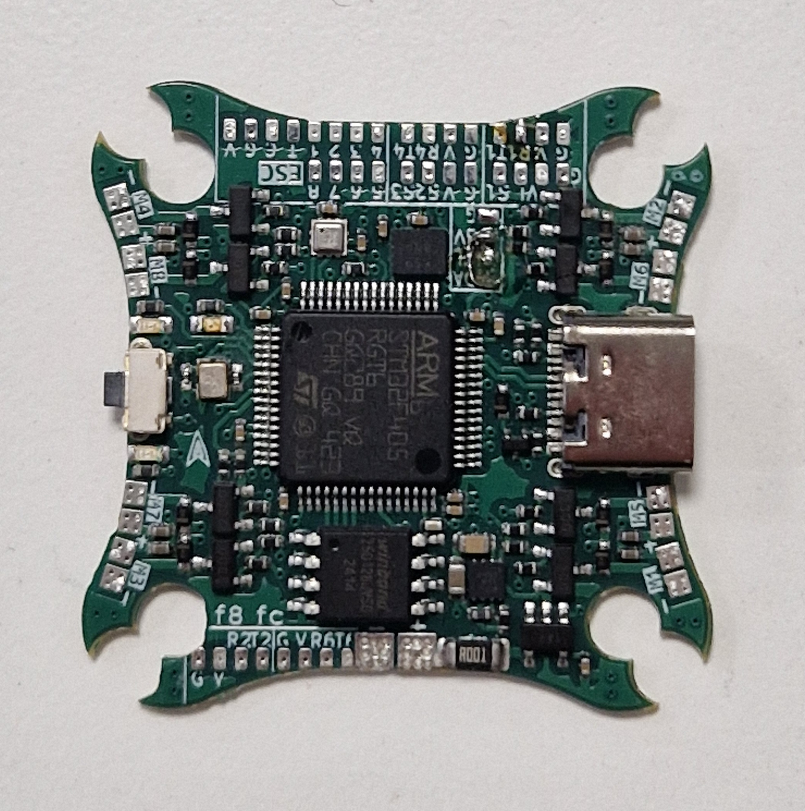

+++
date = '2024-11-28T07:20:14+01:00'
draft = false
title = 'f8 fc'
tags = ['f8-fc', 'hardware', 'ardupilot']
+++
The open-source brushed AIO flight controller for x8 drones.



[f8 fc](https://github.com/victorhook/f8-fc) is a fully open source flight controller that is made primarily for small drones with brushed drones. It features:
- STM32F405 microcontroller with 1MB flash
- BMI270 imu
- BMP388 barometer
- Onboard 16MB external flash for data logging
- Status LEDs
- 1-4s input voltage
- 4 available UARTs
- **8** brushed motor drives with 6A mosfets
- Voltage & current sensing
- Runs ardupilot

## How to flash Ardupilot
1. Get ardupilot toolchain and put the `hwdef.dat` and `hwdef_bl.dat` in `ardupilot/libraries/AP_HAL_ChibiOS/hwdef/f8-fc/`
2. Build bootloader
```
./waf clean
./waf configure --board f8-fc --bootloader
./waf bootloader
```
3. Flash bootloader using something like STM32CubeProgrammer. Hold boot button when powering on the board to boot in DFU mode.
4. Build firmware and upload using the bootloader (have board plugged in to USB and ensure you get a new serial port)
```
./waf configure --board f8-fc
./waf copter --upload
```

## PCB revision A notes
- By accident I chose an active crystal instead of passive crystal. Had to de-solder the crystal (as its pins doesn't match passive) and have it soldered externally. The board worked fine with this setup, but clumpsy to have crystal externally...
- Couldn't fint 8 MHz with 2016 SMD footprint, so had to get 16 MHz. 
- With new crystal, had to reduce stray capacitors, as EKF got crazy, and USB DFU didn't always work on all boards.
- Voltage drops under load could cause the DC-DC to the mcu to potentially brown out. Perhaps it would have been better to have a buck-boost converter instead, to allow the battery voltage to drop below 3.3V for short periods of time without risking the mcu to shutdown.
- Forgot pull-up resistor on I2C bus

### Future revision thoughts
- Add crystal ESR resistor (0R, placeholder initially)
- Add proper ground plane and shielding around the crystal
- Change footprint for crystal. Maybe 2-pin?
- Extra check stray capacitance and calculate thoroughly
- SWD pads should be bigger
- Add pull-up resistor on I2C bus
- Buck-boost converter instead of DC-DC
- SD card slot
- ? ESP32 footprint for telemetry
