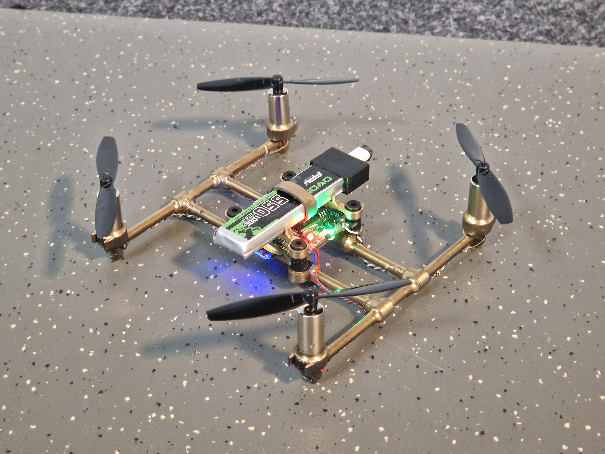
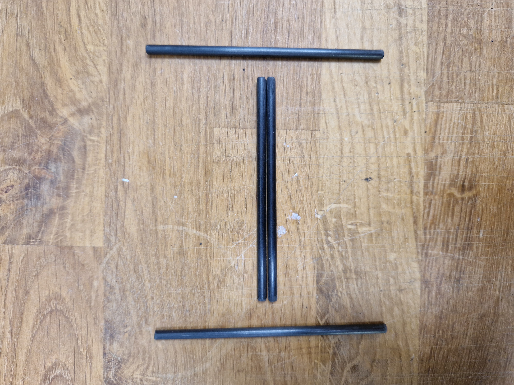
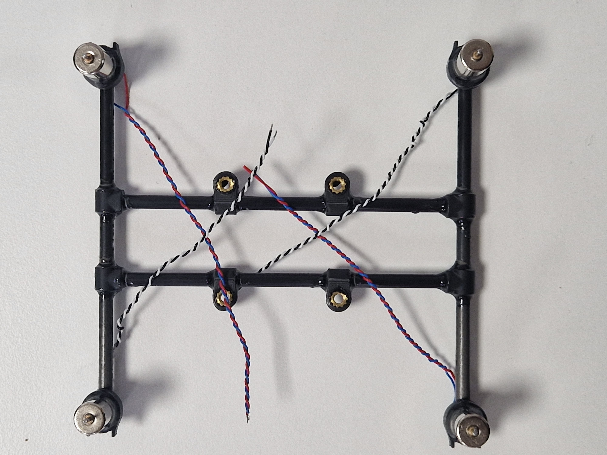
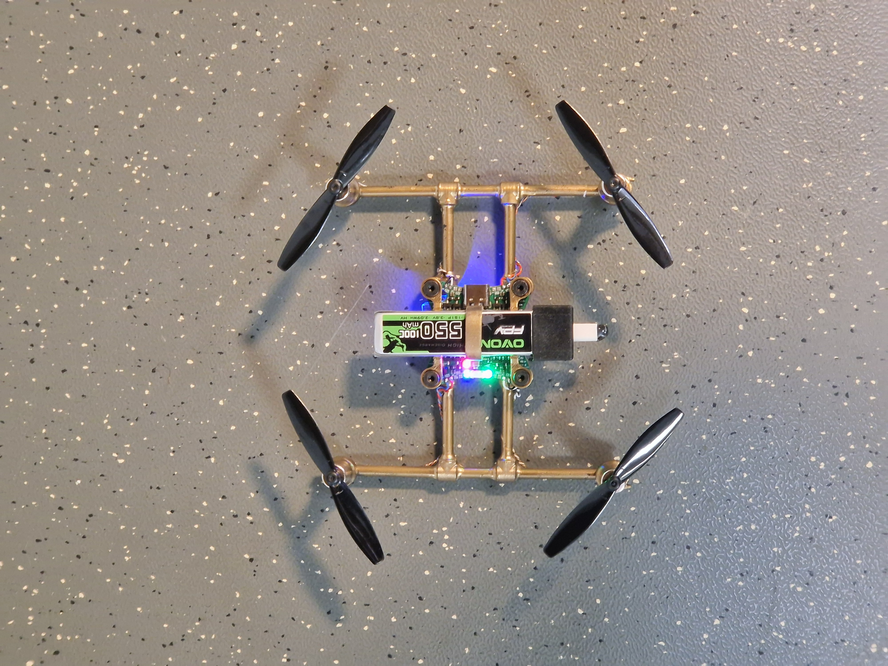
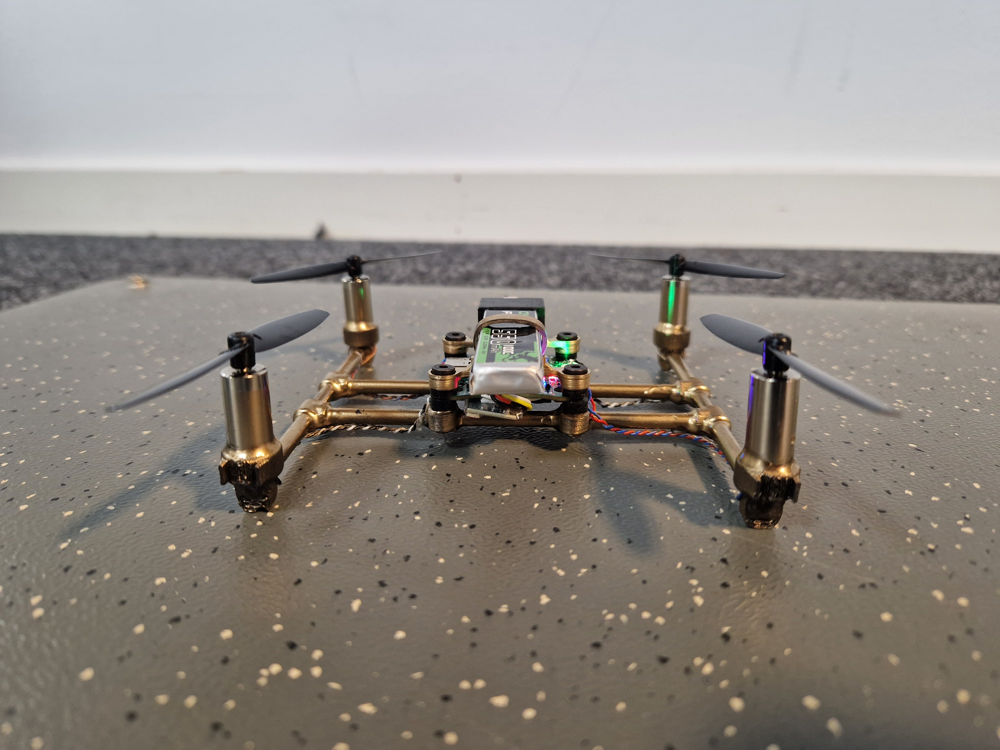

+++
date = '2024-12-03T20:27:44+01:00'
draft = false
title = 'Tiny golden brushed quadcopter'
tags = ['brushed-drone', 'quadcopter', 'f8-fc']
+++

Utilizing [f8 fc](/dronebuilds/posts/f8-fc/) brushed AIO this build became quite neat!

The frame is create by carbon fibre tubes (4x2) and 3D-printed adaptors and motor mounts.

The 3D printed parts and motors are held together with pressfit and epoxy. There are 4 threaded inserts in the middle for the flight controller (30.5 x 30.5).

Once everything was put together I had to add some nice paint to it!

## Components
| Component | Details | Amount | Price each \[$\] | Link |
| --- | --- | --- | --- | --- |
| Flight controller AIO |[f8 fc](/dronebuilds/posts/f8-fc/) | 1 | 20 | [Github](https://github.com/victorhook/f8-fc) |
| Motor | 8520 3.7V | 4 | 2 | [AliExpress](https://vi.aliexpress.com/item/1005007165353286.html?spm=a2g0o.order_list.order_list_main.78.582a1802I4FhN9&gatewayAdapt=glo2vnm) |
| Propeller | 65mm | 4 |0.6 | [AliExpress](https://vi.aliexpress.com/item/4000571823620.html?spm=a2g0o.order_list.order_list_main.53.582a1802I4FhN9&gatewayAdapt=glo2vnm) |
| Battery connector | BetaFPV BT2.0 | 1 | 0.6 | [AliExpress](https://vi.aliexpress.com/item/1005007308458694.html?spm=a2g0o.order_list.order_list_main.58.582a1802I4FhN9&gatewayAdapt=glo2vnm) |
| Dampers | M3 | 4 | 0.15 | [AliExpress](https://vi.aliexpress.com/item/4000712868621.html?spm=a2g0o.order_list.order_list_main.73.582a1802I4FhN9&gatewayAdapt=glo2vnm) |
| Carbon fiber tube | 4x2mm (40cm total) | 1 | 4 | [AliExpress](https://vi.aliexpress.com/item/1005002705392095.html?spm=a2g0o.order_list.order_list_main.88.582a1802I4FhN9&gatewayAdapt=glo2vnm) |
| ELRS Receiver | BETAFPV ELRS Lite 2.4 | 1 | 15 | [AliExpress](https://vi.aliexpress.com/item/1005007199321665.html?spm=a2g0o.productlist.main.23.12bekzxKkzxKC8&algo_pvid=50cdbd9e-af1e-4d62-ae06-abf64c2148a9&algo_exp_id=50cdbd9e-af1e-4d62-ae06-abf64c2148a9-11&pdp_npi=4%40dis%21SEK%21113.73%21113.73%21%21%2110.13%2110.13%21%40211b61ae17331657040922226ee6fa%2112000039779575037%21sea%21SE%211717688001%21X&curPageLogUid=YneHaVrJTtji&utparam-url=scene%3Asearch%7Cquery_from%3A) |

A part from the components above I have used 3D printed parts in PLA, epoxy, bolts & nuts.

**Total price: ~55$**

## Project Result
Hover flight time was approximately 2 minutes. I think the main issue is that it weighs too much, so further revisions should make it even lighter!