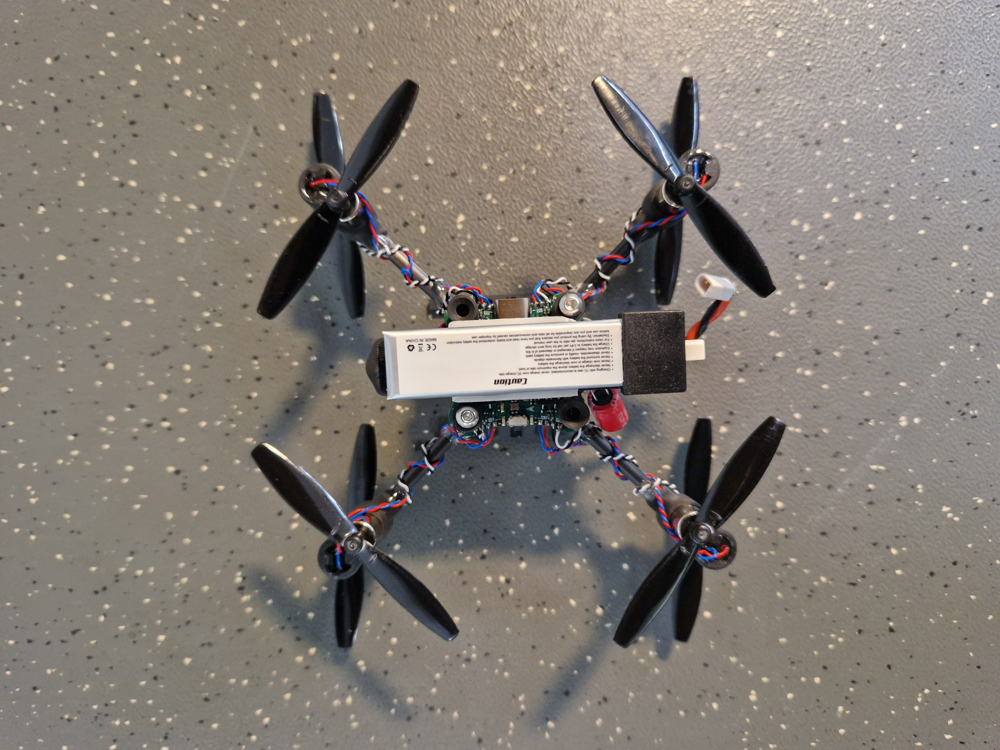
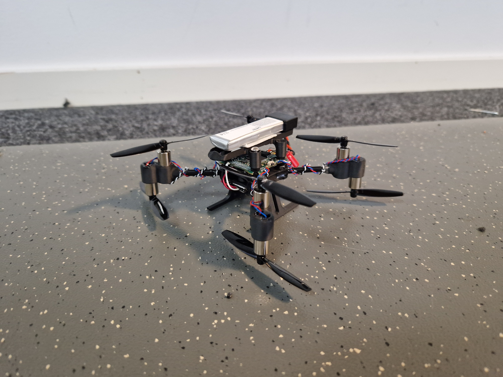

+++
date = '2024-11-28T07:20:14+01:00'
draft = false
title = 'The worlds smallest x8 drone with brushed motors'
+++

I've wanted to build a mini x8 drone with brushed motors for some time it's finally time! Everything is first sketched and modelled in Fusion360.

## Project Goal
Build a tiny x8 drone with brushed motors that can fly with Ardupilot.

## Components
| Component | Details | Amount | Price each \[$\] | Link |
| --- | --- | --- | --- | --- |
| Flight controller AIO |[f8 fc](/dronebuilds/posts/f8-fc/) | 1 | 20 | [Github](https://github.com/victorhook/f8-fc) |
| Motor | 8520 3.7V | 8 | 2 | [AliExpress](https://vi.aliexpress.com/item/1005007165353286.html?spm=a2g0o.order_list.order_list_main.78.582a1802I4FhN9&gatewayAdapt=glo2vnm) |
| Propeller | 65mm | 8 |0.6 | [AliExpress](https://vi.aliexpress.com/item/4000571823620.html?spm=a2g0o.order_list.order_list_main.53.582a1802I4FhN9&gatewayAdapt=glo2vnm) |
| Battery connector | BetaFPV BT2.0 | 1 | 0.6 | [AliExpress](https://vi.aliexpress.com/item/1005007308458694.html?spm=a2g0o.order_list.order_list_main.58.582a1802I4FhN9&gatewayAdapt=glo2vnm) |
| Dampers | M3 | 4 | 0.15 | [AliExpress](https://vi.aliexpress.com/item/4000712868621.html?spm=a2g0o.order_list.order_list_main.73.582a1802I4FhN9&gatewayAdapt=glo2vnm) |
| Carbon fiber tube | 4x2mm (~40cm total) | 1 | 4 | [AliExpress](https://vi.aliexpress.com/item/1005002705392095.html?spm=a2g0o.order_list.order_list_main.88.582a1802I4FhN9&gatewayAdapt=glo2vnm) |
| ELRS Receiver | BETAFPV ELRS Lite 2.4 | 1 | 15 | [AliExpress](https://vi.aliexpress.com/item/1005007199321665.html?spm=a2g0o.productlist.main.23.12bekzxKkzxKC8&algo_pvid=50cdbd9e-af1e-4d62-ae06-abf64c2148a9&algo_exp_id=50cdbd9e-af1e-4d62-ae06-abf64c2148a9-11&pdp_npi=4%40dis%21SEK%21113.73%21113.73%21%21%2110.13%2110.13%21%40211b61ae17331657040922226ee6fa%2112000039779575037%21sea%21SE%211717688001%21X&curPageLogUid=YneHaVrJTtji&utparam-url=scene%3Asearch%7Cquery_from%3A) |

A part from the components above I have used 3D printed parts in PLA, epoxy, bolts & nuts.

**Total price: ~65$**

## Project Result
While the drone does indeed fly, and can even lift with a big high discharge li-on 18650 battery, it is simply too inefficient. The main issue is that the voltage drop of the battery is too heavy and quite fast drops below 3.3V on occasions. This causes the 3.3V DC-DC the go down, causing the mcu to brown out, which in turns results in a very fast crash of the drone.

There is kind of a negative spiral when adding the extra for motors as this not only adds weight, but also adds an additional for motors that will consume current to lift this weight. Also, using a coaxial drive means that we'll loose some efficiency.